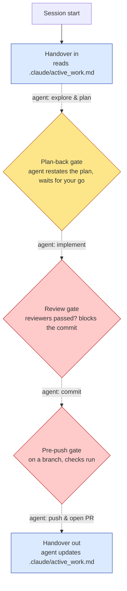

# claude-project-kit

[](https://gitlab.com/rami.al-fahham/claude-project-kit/-/pipelines)
[](LICENSE)

Repo-level guardrails for AI-assisted development, in any language. They live in a
self-contained `.claude/` committed to your repo — no plugin, no machine install, nothing
global. The agent agrees a plan with you before writing code, each change is reviewed before
it's committed, and your git history stays safe.

## What it does

- **Plans before coding.** The agent restates the task and waits for your approval before
  editing any files.
- **Reviews before committing.** Adversarial reviewers (scope, and platform/CI/tooling) check
  each change before the commit goes through.
- **Keeps git safe.** Work stays on a feature branch; committing or pushing to `main`,
  rewriting history, and merging your own PRs are blocked.
- **Carries context across sessions.** A short handover note records where you left off, so a
  new chat continues cleanly.

## Why repo-level, not a plugin

The guardrails live in your repo's own `.claude/`, not in machine-wide config:

- **Scoped, not leaking.** The gates apply to *this* repo only — they can't bleed into
  unrelated repos.
- **Visible and trusted.** The hook code is committed and shows up in the diff. Nobody has to
  install arbitrary global hook code; Claude Code prompts once to trust the project's hooks.
- **No install step.** You copy `.claude/` in (or start from the template) and the guardrails
  are already wired in `.claude/settings.json`. Nothing to add to `~/.claude/`.

## The checkpoints

The agent does the work along the arrows — explore, plan, implement, commit, push. The kit
adds five checkpoints where you stay in control: it carries your handover notes (blue), waits
for you to approve the plan before any code (yellow), and blocks the commit and the push until
their checks pass (red).



Hooks fail open on error, so a bug can't lock you out; the guards that stop you block on purpose.

## Add it to a repo

Clone this and run the bootstrap script against your target repo:

```bash
git clone https://gitlab.com/rami.al-fahham/claude-project-kit
claude-project-kit/scripts/bootstrap.sh /path/to/your-repo
```

It copies the `.claude/` guardrails and the `task/` templates in — no plugin, nothing global.
Safe to re-run to pull updates: the guard *code* is refreshed, while your own `settings.json`,
`review_routing.json`, and handover are left untouched (`--force` to overwrite, `--dry-run` to
preview). Then commit the new `.claude/` and approve the hooks on the next Claude Code session.
Run it with `--help` for the full usage.

**Getting a tailored reviewer set, not just the two defaults.** Run the `/setup-project` skill
from a `claude-project-kit` checkout (in Claude Code, after cloning this repo) to interview you
on your project's stack, its issue tracker, and how much process it needs (Standard, or a
lighter Solo/small tier), then generate a setup to match — see
[What's in the repo](#whats-in-the-repo) below.

**Pulling in later kit improvements.** Every bootstrap/re-run stamps `.claude/.kit-version`
with the commit this checkout is on, so you can always tell which version a project was last
updated from. To update: re-run `bootstrap.sh` (refreshes the guard code, as above). If the
project was set up via `/setup-project`, the kit doesn't remember which stack you answered with
— re-run `scripts/generate_project_setup.py --target /path/to/project` with the SAME stack flags
you originally gave the interview (`--dbt`, `--data-eng`, etc.); passing the wrong ones shrinks
the reviewer set. It refuses to touch a `review_routing.json`/`guard-paths.md` you've since
hand-tuned unless you also pass `--force`; `working-agreement.md` is narrower still and
depends on which process tier you pass — Standard tier only ever writes it to reverse a
recognized prior Solo choice or fill in a missing file, and `--force` there only overrides an
unrecognized (hand-customized) file, never a recognized standard default of any vintage;
Solo tier converts whatever's there, `--force` required only if it's unrecognized. Only pass
`--force` once you've confirmed the flags are right, never as a matter of
course.

## Requirements

The hooks are small Python scripts run through a bash shell, so the machine running Claude Code
needs **Python 3 reachable as `python` on `PATH`** and **a bash shell** (Git Bash or WSL on
Windows). If `python` isn't found the hooks fail open — a session-start preflight warns you
instead of leaving you unknowingly unguarded.

## What's in the repo

- **`.claude/`** — the guardrails, committed and readable: the hooks (`.claude/hooks/`), the
  baseline reviewers (`.claude/agents/` — `scope-auditor`, always required, and `platform-reviewer`,
  this kit's own general platform reviewer), the `status` command, the `setup-project` interview
  skill (`.claude/skills/setup-project/`), `settings.json` wiring the hooks,
  `working-agreement.md` (the rules the hooks and reviewers reference), and
  `review_routing.json`. The handover lives at `.claude/active_work.md`.
- **`templates/reviewers/`** — a library of hand-authored, function-named reviewer modules
  (`platform-reviewer`, `data-engineer-reviewer`, `analytics-engineer-reviewer`,
  `frontend-reviewer`, `security-reviewer`, each tagged with which stack it applies to) plus
  routing fragments for composing them into a project's `review_routing.json`. A generic
  reviewer synthesized from a checklist reproduces the "one overloaded reviewer" failure this
  design deliberately avoids — see `docs/decisions/module-library-vs-templating.md`.
- **`scripts/`** — `bootstrap.sh` (copies `.claude/` into an existing repo); `compose_routing.py`
  and `lint_reviewer_name.py` (merge routing fragments, reject corporate-title reviewer names);
  `promote_reviewer.py` (graduates a proven drafted reviewer into the library); `preview_project_setup.py`
  and `generate_project_setup.py` (the `/setup-project` interview's dry-run preview and actual
  generation — select a reviewer set for a project's stack, compose its routing, and write it in);
  `audit_ci_automation.py` (advisory scan for CI-side auto-merge automation no local git hook can
  see).
- **`task/`** — the contract + review templates the review cycle uses.

Run `/setup-project` (a Claude Code skill, from a `claude-project-kit` checkout) to interview a
project on its stack and generate a tailored reviewer set instead of the two defaults — see
`docs/project-kit-design.md` for how the pieces above fit together.

## Design decisions

- **Repo-level, not a global plugin.** The config lives in the repo, is scoped to it, shows up
  in the diff, and needs no machine install. The cost is that each repo carries its own copy of
  `.claude/`; the benefit is no leakage, a visible per-repo trust decision, and nothing to install.
- **Reviewers run blinded and adversarial.** Each reviewer sees the branch's cumulative diff cold,
  with no memory of the conversation that produced it — so the review catches what the author's
  context talked them into.
- **The commit gate hard-blocks; it isn't advice.** A commit is refused until the review matches
  the branch's current cumulative diff and every required reviewer has passed.
- **Hooks fail open, guards fail closed.** A hook that errors lets you through — tooling shouldn't
  lock you out of your own repo. The guards whose whole job is to stop you (branch discipline, the
  review gate) block by design.

## How the review gate works

1. You stage your change (`git add ...`).
2. You run the reviewers the routing requires and write `.claude/task/review.md` (copy
   `task/REVIEW_TEMPLATE.md`), pasting the diff hash (`commit_review_gate.py --diff-hash`) —
   the branch's cumulative diff since it split from `main`, plus what's staged now, not just
   this commit's own staged change.
3. `git commit` is blocked until the review matches that cumulative diff, every required
   reviewer passed, and any escalation has an answer.

## Related

- **[dbt-agent-kit](https://github.com/ramialfahham/dbt-agent-kit)** — these guardrails plus a
  dbt overlay (dbt reviewers, a project scaffold, layer rules) for analytics-engineering repos.
- **[claude-skills](https://github.com/ramialfahham/claude-skills)** — general-purpose personal
  skills installed globally into `~/.claude/skills/`.
